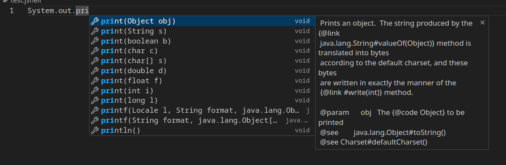

<!--

    Licensed to the Apache Software Foundation (ASF) under one
    or more contributor license agreements.  See the NOTICE file
    distributed with this work for additional information
    regarding copyright ownership.  The ASF licenses this file
    to you under the Apache License, Version 2.0 (the
    "License"); you may not use this file except in compliance
    with the License.  You may obtain a copy of the License at

      http://www.apache.org/licenses/LICENSE-2.0

    Unless required by applicable law or agreed to in writing,
    software distributed under the License is distributed on an
    "AS IS" BASIS, WITHOUT WARRANTIES OR CONDITIONS OF ANY
    KIND, either express or implied.  See the License for the
    specific language governing permissions and limitations
    under the License.

-->

This is a demo extension for VS Code, showing enhanced JShell code completion.

__Warning:__ This is not a functional extension. The only purpose of this demo is to
show what is possible with the experimental API for JShell code completion. It is
also not guaranteed the API will be finalized.

# Use

To see the feature in action:

- have a build of JDK from this branch ready: https://github.com/lahodaj/jdk/tree/JDK-8366691 ; lets mark the directory with the JDK image `JDK_IMAGE`
- build this demo:
```
$ JAVA_HOME=$JDK_IMAGE npm run build-server
$ npm install
$ npm run compile
```
- open this directory in VS Code, and start the extension (press `F5`)
- create a file with extension `.jshell`
- code completion should work inside this file, for JShell snippets



The main conversion is done here:
[server/src/main/java/org/openjdk/jshell/integration/server/JShellCompletionProvider.java](server/src/main/java/org/openjdk/jshell/integration/server/JShellCompletionProvider.java)

# History

Based on original NetBeans VS Code extension, which in turn was based on "lsp-sample" from:
https://github.com/microsoft/vscode-extension-samples
